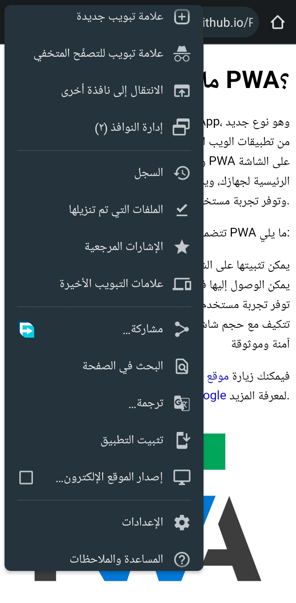

# PWA

PWA تعني Progressive Web App، وهي تطبيقات ويب مصممة للعمل مثل التطبيقات الأصلية. يمكنها تشغيلها في وضع عدم الاتصال، وتلقي إشعارات، وإنشاء اختصارات على سطح المكتب، والمزيد.

## الفوائد

هناك العديد من الفوائد لتطوير PWA، بما في ذلك:

* **تجربة مستخدم أفضل:** يمكن لـ PWA تقديم تجربة مستخدم أكثر سلاسة وغنية بالميزات مما يمكن للتطبيقات التقليدية.
* **وصول أفضل:** يمكن لـ PWA الوصول إلى جمهور أوسع من المستخدمين، بما في ذلك أولئك الذين ليس لديهم إمكانية الوصول إلى متاجر التطبيقات.
* **تحسين محركات البحث:** يمكن أن تساعد PWA في تحسين ترتيب موقع الويب الخاص بك في نتائج بحث Google.

## كيفية إنشاء PWA

هناك العديد من الطرق لإنشاء PWA، ولكن أبسط طريقة هي استخدام إطار عمل تطوير PWA. هناك العديد من إطارات العمل المتاحة، بما في ذلك:

* **Angular PWA:** إطار عمل Angular لإنشاء PWA.
* **React PWA:** إطار عمل React لإنشاء PWA.
* **Vue PWA:** إطار عمل Vue لإنشاء PWA.

## أمثلة

فيما يلي بعض الأمثلة على PWA:

* **تويتر:** PWA من Twitter يسمح لك بالوصول إلى حساب Twitter الخاص بك حتى في حالة عدم الاتصال بالإنترنت.
* **Google Maps:** PWA من Google Maps يسمح لك بعرض الخرائط والتنقل حتى في حالة عدم الاتصال بالإنترنت.
* **Spotify:** PWA من Spotify يسمح لك بالاستماع إلى الموسيقى حتى في حالة عدم الاتصال بالإنترنت.

## لقطات شاشة

* 
* 

## وصف الميزات

PWA الخاص بك يتميز بميزات مثل:

* **تشغيل في وضع عدم الاتصال:** يمكنك الوصول إلى PWA الخاص بك حتى في حالة عدم الاتصال بالإنترنت.
* **تلقي إشعارات:** يمكنك تلقي إشعارات من PWA الخاص بك.
* **إنشاء اختصارات على سطح المكتب:** يمكنك إنشاء اختصارات على سطح المكتب لـ PWA الخاص بك.

## تثبيت

لإعداد PWA الخاص بك على جهازك، اتبع هذه الخطوات:

1. افتح PWA الخاص بك في متصفحك.
2. اضغط على زر **إضافة إلى الشاشة الرئيسية**.
3. اتبع التعليمات التي تظهر على الشاشة.

## موارد أخرى

* [موقع PWA](https://developers.google.com/web/progressive-web-apps)
* [دليل PWA](https://developers.google.com/web/progressive-web-apps/docs/)
* [مرجع PWA](https://developers.google.com/web/progressive-web-apps/reference/)

## رابط Demo

[https://abdoly54.github.io/PWA/](https://abdoly54.github.io/PWA/)

## رابط تحميل سورس كود للتعلم منه

[https://github.com/AbdoLY54/PWA/releases/tag/v1.0](https://github.com/AbdoLY54/PWA/releases/tag/v1.0)

